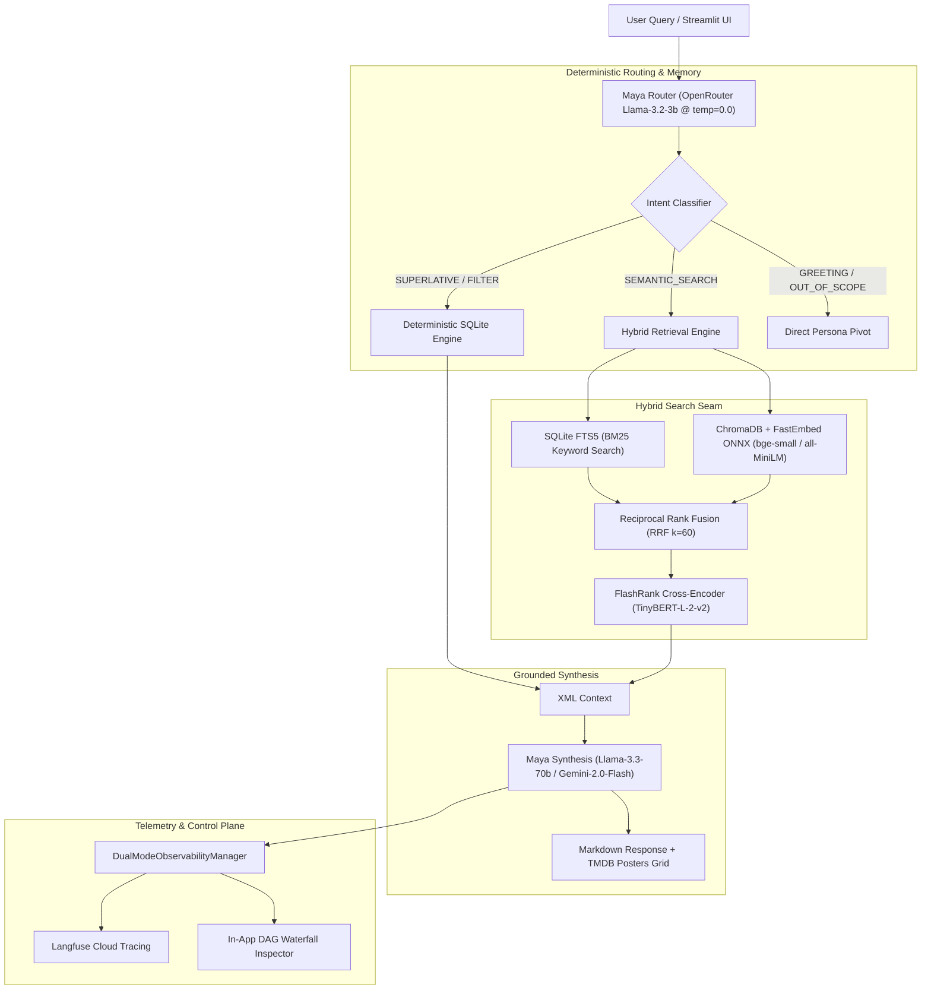

# 🎬 TMDB RAG & Evaluation Harness ("Maya")

[](https://www.python.org/downloads/)
[]()
[]()
[]()
[]()
[]()
[](LICENSE)

An observable, multi-version **Retrieval-Augmented Generation (RAG)** pipeline and **Evaluation Harness** specialized in US theatrical releases from **1970 to 2026** (9,119 curated films). 

Fronted by **"Maya"**, a conversational film curator featuring deterministic intent routing, Closed-World Assumption (CWA) grounding, high-resolution poster rendering, 5-layer multi-turn conversational memory, and full-fidelity **Langfuse Cloud** telemetry alongside an in-app Streamlit trace inspector.

---

## 🏛️ System Architecture



---

## 🗄️ Storage Engine & SQLite FTS5 Explained

The storage layer ([`src/storage/database.py`](file:///D:/GitHub_Repo/TMDB_project_new/src/storage/database.py)) uses a local SQLite database (`data/tmdb_movies.db`) bundled with **9,119 movies** across 1970–2026.

### Why Are There Multiple `movies_fts_*` Tables?
When creating SQLite's virtual full-text search table (`movies_fts`), SQLite automatically provisions internal **Shadow Tables** to manage the inverted index and compute **Okapi BM25** ranking without third-party server dependencies:

| Table Name | Purpose & Internal Mechanics |
| :--- | :--- |
| **`movies`** | Main relational table holding 20 normalized attributes (`id`, `title`, `overview`, `release_year`, `director`, `budget`, `revenue`, `genres_json`, `cast_json`, `keywords_json`). |
| **`movies_fts`** | Logical full-text virtual table interface queried via `WHERE movies_fts MATCH '...'` and ranked with `bm25(movies_fts)`. |
| **`movies_fts_data`** | Stores the **inverted index postings** (mapping word stems like `"space"` or `"nolan"` to movie row IDs). |
| **`movies_fts_idx`** | B-Tree index over data segments for sub-millisecond term lookups. |
| **`movies_fts_docsize`** | Stores the exact **word count (document length)** of each field per movie to compute BM25 document length normalization ($\frac{|D|}{avgdl}$). |
| **`movies_fts_config`** | Stores tokenizer configurations (`porter unicode61`). |
| **`user_feedback`** | Stores in-app thumbs up / thumbs down ratings linked to specific `trace_id` records. |
| **`budget_tracker`** | Logs daily token usage and USD costs to prevent API overspending. |

---

## 🚀 Quick Start

### 1. Prerequisites
- Python 3.11+
- Node.js (for `dotenvx` encrypted secret management)

### 2. Setup Virtual Environment
```bash
# Clone the repository
git clone https://github.com/rishib09/TMDB_project_new.git
cd TMDB_project_new

# Create virtual environment and install dependencies
python -m venv .venv
.\.venv\Scripts\pip install -r requirements.txt
```

### 3. Configure API Keys via `dotenvx`
Use `dotenvx` to set your credentials securely without plaintext leaks:
```powershell
npx @dotenvx/dotenvx set OPENROUTER_API_KEY "sk-or-v1-your-key"
npx @dotenvx/dotenvx set TMDB_API_KEY "your-tmdb-key"
npx @dotenvx/dotenvx set TMDB_READ_ACCESS_TOKEN "your-tmdb-token"

# Optional: Langfuse Cloud Telemetry
npx @dotenvx/dotenvx set LANGFUSE_PUBLIC_KEY "pk-lf-..."
npx @dotenvx/dotenvx set LANGFUSE_SECRET_KEY "sk-lf-..."
npx @dotenvx/dotenvx set LANGFUSE_HOST "https://cloud.langfuse.com"
```

---

## 🧪 Running the Test Suite

We practice strict **Real-Data Integration & Adversarial Testing** (all 13 tests execute against the 9,119-movie SQLite database in < 1 second):

```powershell
# Run all tests
.\.venv\Scripts\pytest -v

# Run only integration tests
.\.venv\Scripts\pytest -m integration -v

# Run only adversarial integrity tests
.\.venv\Scripts\pytest -m adversarial -v
```

---

## 🗺️ Project Roadmap & Live Issues

All vertical slices are tracked live on GitHub:
- [x] [**Issue #1: Scaffolding, Domain Entities & TMDB Ingestion (9,119 Movies)**](https://github.com/rishib09/TMDB_project_new/issues/1) - *COMPLETED*
- [ ] [**Issue #2: FastEmbed ONNX Vector Indexing & ChromaDB Collections**](https://github.com/rishib09/TMDB_project_new/issues/2) - *Next Up*
- [ ] [**Issue #3: Deterministic Maya Router, Multi-Turn Memory & Query Reformulation**](https://github.com/rishib09/TMDB_project_new/issues/3)
- [ ] [**Issue #4: Hybrid RAG Search Engine with RRF & FlashRank Reranker**](https://github.com/rishib09/TMDB_project_new/issues/4)
- [ ] [**Issue #5: LangGraph StateGraph Workflow & Closed-World Synthesis**](https://github.com/rishib09/TMDB_project_new/issues/5)
- [ ] [**Issue #6: Two-Tier Benchmark Evaluation Suite & Metrics Runner**](https://github.com/rishib09/TMDB_project_new/issues/6)
- [ ] [**Issue #7: Streamlit Multi-Tab UI & Hugging Face Spaces Deployment**](https://github.com/rishib09/TMDB_project_new/issues/7)
- [x] [**Issue #8: Security Layer, Prompt Injection Guardrails & Budget Limits**](https://github.com/rishib09/TMDB_project_new/issues/8)
- [x] [**Issue #9: Streamlit In-App User Feedback & Langfuse Scoring**](https://github.com/rishib09/TMDB_project_new/issues/9)
- [x] [**Issue #10: Maya Transparent System Prompt & Architectural Self-Awareness**](https://github.com/rishib09/TMDB_project_new/issues/10)
- [ ] [**Issue #11: Embedding Column Selection & Token Budget Optimization**](https://github.com/rishib09/TMDB_project_new/issues/11)

---

## 📄 License
MIT License. Created by Rishi B.
