# Class diagram — `src/` (all packages, methods hidden)

Every class under `src/` with `..> uses (n)` associations collapsed from n method-level call edges; methods hidden to keep 50 classes readable. Generated from `.codemap/graph.json`.

```mermaid
classDiagram
  class src_domain_config_py__PresetType["PresetType"] {
  }
  note for src_domain_config_py__PresetType "src/domain/config.py:9"
  class src_domain_config_py__ExperimentConfig["ExperimentConfig"] {
  }
  note for src_domain_config_py__ExperimentConfig "src/domain/config.py:17"
  class src_domain_memory_py__ChatMessage["ChatMessage"] {
  }
  note for src_domain_memory_py__ChatMessage "src/domain/memory.py:17"
  class src_domain_memory_py__FocusedMovieEntity["FocusedMovieEntity"] {
  }
  note for src_domain_memory_py__FocusedMovieEntity "src/domain/memory.py:31"
  class src_domain_memory_py__UserSessionPreferences["UserSessionPreferences"] {
  }
  note for src_domain_memory_py__UserSessionPreferences "src/domain/memory.py:39"
  class src_domain_memory_py__ConversationState["ConversationState"] {
  }
  note for src_domain_memory_py__ConversationState "src/domain/memory.py:171"
  class src_domain_movie_py__TokenCounter["TokenCounter"] {
  }
  note for src_domain_movie_py__TokenCounter "src/domain/movie.py:8"
  class src_domain_movie_py__CastMember["CastMember"] {
  }
  note for src_domain_movie_py__CastMember "src/domain/movie.py:24"
  class src_domain_movie_py__MovieRecord["MovieRecord"] {
  }
  note for src_domain_movie_py__MovieRecord "src/domain/movie.py:40"
  class src_domain_routing_py__IntentType["IntentType"] {
  }
  note for src_domain_routing_py__IntentType "src/domain/routing.py:9"
  class src_domain_routing_py__SuperlativeMetric["SuperlativeMetric"] {
  }
  note for src_domain_routing_py__SuperlativeMetric "src/domain/routing.py:20"
  class src_domain_routing_py__SuperlativeCriteria["SuperlativeCriteria"] {
  }
  note for src_domain_routing_py__SuperlativeCriteria "src/domain/routing.py:30"
  class src_domain_routing_py__MetadataFilterCriteria["MetadataFilterCriteria"] {
  }
  note for src_domain_routing_py__MetadataFilterCriteria "src/domain/routing.py:39"
  class src_domain_routing_py__QueryRoutingDecision["QueryRoutingDecision"] {
  }
  note for src_domain_routing_py__QueryRoutingDecision "src/domain/routing.py:58"
  class src_evals_judge_py__FaithfulnessVerdict["FaithfulnessVerdict"] {
  }
  note for src_evals_judge_py__FaithfulnessVerdict "src/evals/judge.py:47"
  class src_evals_judge_py__RelevancyVerdict["RelevancyVerdict"] {
  }
  note for src_evals_judge_py__RelevancyVerdict "src/evals/judge.py:61"
  class src_evals_judge_py__MayaJudge["MayaJudge"] {
  }
  note for src_evals_judge_py__MayaJudge "src/evals/judge.py:68"
  class src_evals_metrics_py__QueryEvalResult["QueryEvalResult"] {
  }
  note for src_evals_metrics_py__QueryEvalResult "src/evals/metrics.py:64"
  class src_evals_metrics_py__BenchmarkSummary["BenchmarkSummary"] {
  }
  note for src_evals_metrics_py__BenchmarkSummary "src/evals/metrics.py:89"
  class src_evals_runner_py__BenchmarkRunner["BenchmarkRunner"] {
  }
  note for src_evals_runner_py__BenchmarkRunner "src/evals/runner.py:125"
  class src_feedback_store_py__FeedbackStore["FeedbackStore"] {
  }
  note for src_feedback_store_py__FeedbackStore "src/feedback/store.py:19"
  class src_graph_state_py__SynthesisUsage["SynthesisUsage"] {
  }
  note for src_graph_state_py__SynthesisUsage "src/graph/state.py:34"
  class src_graph_state_py__MayaGraphState["MayaGraphState"] {
  }
  note for src_graph_state_py__MayaGraphState "src/graph/state.py:42"
  class src_indexing_embeddings_py__EmbeddingProvider["EmbeddingProvider"] {
  }
  note for src_indexing_embeddings_py__EmbeddingProvider "src/indexing/embeddings.py:24"
  class src_indexing_embeddings_py__CharEstimateCounter["CharEstimateCounter"] {
  }
  note for src_indexing_embeddings_py__CharEstimateCounter "src/indexing/embeddings.py:40"
  class src_indexing_embeddings_py__FastembedProvider["FastembedProvider"] {
  }
  note for src_indexing_embeddings_py__FastembedProvider "src/indexing/embeddings.py:82"
  class src_indexing_embeddings_py__FastembedTokenCounter["FastembedTokenCounter"] {
  }
  note for src_indexing_embeddings_py__FastembedTokenCounter "src/indexing/embeddings.py:113"
  class src_indexing_embeddings_py__OpenRouterEmbeddingProvider["OpenRouterEmbeddingProvider"] {
  }
  note for src_indexing_embeddings_py__OpenRouterEmbeddingProvider "src/indexing/embeddings.py:200"
  class src_indexing_vector_store_py___BlockedOTLPSpanExporter["_BlockedOTLPSpanExporter"] {
  }
  note for src_indexing_vector_store_py___BlockedOTLPSpanExporter "src/indexing/vector_store.py:24"
  class src_indexing_vector_store_py__SearchResult["SearchResult"] {
  }
  note for src_indexing_vector_store_py__SearchResult "src/indexing/vector_store.py:58"
  class src_indexing_vector_store_py__MovieVectorStore["MovieVectorStore"] {
  }
  note for src_indexing_vector_store_py__MovieVectorStore "src/indexing/vector_store.py:66"
  class src_maya_agent_py__CwaViolation["CwaViolation"] {
  }
  note for src_maya_agent_py__CwaViolation "src/maya/agent.py:65"
  class src_maya_agent_py__MayaSynthesizer["MayaSynthesizer"] {
  }
  note for src_maya_agent_py__MayaSynthesizer "src/maya/agent.py:72"
  class src_maya_guardrails_py__GuardrailVerdict["GuardrailVerdict"] {
  }
  note for src_maya_guardrails_py__GuardrailVerdict "src/maya/guardrails.py:26"
  class src_maya_guardrails_py__GuardrailResult["GuardrailResult"] {
  }
  note for src_maya_guardrails_py__GuardrailResult "src/maya/guardrails.py:34"
  class src_maya_guardrails_py__InjectionFilter["InjectionFilter"] {
  }
  note for src_maya_guardrails_py__InjectionFilter "src/maya/guardrails.py:43"
  class src_maya_guardrails_py__OffTopicPivot["OffTopicPivot"] {
  }
  note for src_maya_guardrails_py__OffTopicPivot "src/maya/guardrails.py:100"
  class src_maya_guardrails_py__SessionTokenLimiter["SessionTokenLimiter"] {
  }
  note for src_maya_guardrails_py__SessionTokenLimiter "src/maya/guardrails.py:137"
  class src_maya_guardrails_py__BudgetSink["BudgetSink"] {
  }
  note for src_maya_guardrails_py__BudgetSink "src/maya/guardrails.py:200"
  class src_maya_guardrails_py__WeeklyBudgetTracker["WeeklyBudgetTracker"] {
  }
  note for src_maya_guardrails_py__WeeklyBudgetTracker "src/maya/guardrails.py:233"
  class src_maya_probing_py__ProbeQuestion["ProbeQuestion"] {
  }
  note for src_maya_probing_py__ProbeQuestion "src/maya/probing.py:99"
  class src_maya_probing_py__FunnelOutcome["FunnelOutcome"] {
  }
  note for src_maya_probing_py__FunnelOutcome "src/maya/probing.py:371"
  class src_maya_router_py__MayaRouter["MayaRouter"] {
  }
  note for src_maya_router_py__MayaRouter "src/maya/router.py:123"
  class src_observability_trace_fetch_py__ObservationNode["ObservationNode"] {
  }
  note for src_observability_trace_fetch_py__ObservationNode "src/observability/trace_fetch.py:27"
  class src_observability_trace_fetch_py__TraceTree["TraceTree"] {
  }
  note for src_observability_trace_fetch_py__TraceTree "src/observability/trace_fetch.py:51"
  class src_observability_tracer_py__DualModeObservabilityManager["DualModeObservabilityManager"] {
  }
  note for src_observability_tracer_py__DualModeObservabilityManager "src/observability/tracer.py:23"
  class src_retrieval_hybrid_engine_py__RetrievalResult["RetrievalResult"] {
  }
  note for src_retrieval_hybrid_engine_py__RetrievalResult "src/retrieval/hybrid_engine.py:19"
  class src_retrieval_hybrid_engine_py__HybridRetrievalEngine["HybridRetrievalEngine"] {
  }
  note for src_retrieval_hybrid_engine_py__HybridRetrievalEngine "src/retrieval/hybrid_engine.py:34"
  class src_storage_database_py__MovieDatabase["MovieDatabase"] {
  }
  note for src_storage_database_py__MovieDatabase "src/storage/database.py:13"
  class src_ui_session_py__MayaSession["MayaSession"] {
  }
  note for src_ui_session_py__MayaSession "src/ui/session.py:89"
  src_domain_movie_py__MovieRecord ..> src_domain_movie_py__TokenCounter : uses (2)
  src_evals_runner_py__BenchmarkRunner ..> src_maya_guardrails_py__WeeklyBudgetTracker : uses (2)
  src_evals_runner_py__BenchmarkRunner ..> src_retrieval_hybrid_engine_py__HybridRetrievalEngine : uses (1)
  src_evals_runner_py__BenchmarkRunner ..> src_evals_judge_py__MayaJudge : uses (2)
  src_evals_runner_py__BenchmarkRunner ..> src_maya_router_py__MayaRouter : uses (1)
  src_indexing_embeddings_py__FastembedProvider ..> src_indexing_embeddings_py__EmbeddingProvider : uses (2)
  src_indexing_embeddings_py__FastembedProvider ..> src_indexing_embeddings_py__OpenRouterEmbeddingProvider : uses (2)
  src_indexing_embeddings_py__OpenRouterEmbeddingProvider ..> src_indexing_vector_store_py__MovieVectorStore : uses (1)
  src_indexing_vector_store_py__MovieVectorStore ..> src_indexing_embeddings_py__EmbeddingProvider : uses (3)
  src_indexing_vector_store_py__MovieVectorStore ..> src_indexing_embeddings_py__FastembedProvider : uses (3)
  src_indexing_vector_store_py__MovieVectorStore ..> src_indexing_embeddings_py__OpenRouterEmbeddingProvider : uses (3)
  src_indexing_vector_store_py__MovieVectorStore ..> src_domain_movie_py__MovieRecord : uses (1)
  src_maya_guardrails_py__InjectionFilter ..> src_indexing_vector_store_py__MovieVectorStore : uses (1)
  src_maya_guardrails_py__WeeklyBudgetTracker ..> src_maya_guardrails_py__BudgetSink : uses (3)
  src_maya_router_py__MayaRouter ..> src_indexing_vector_store_py__MovieVectorStore : uses (3)
  src_maya_router_py__MayaRouter ..> src_domain_memory_py__UserSessionPreferences : uses (1)
  src_retrieval_hybrid_engine_py__HybridRetrievalEngine ..> src_storage_database_py__MovieDatabase : uses (4)
  src_retrieval_hybrid_engine_py__HybridRetrievalEngine ..> src_indexing_vector_store_py__MovieVectorStore : uses (1)
  src_ui_session_py__MayaSession ..> src_storage_database_py__MovieDatabase : uses (1)
  src_ui_session_py__MayaSession ..> src_observability_tracer_py__DualModeObservabilityManager : uses (5)
  src_ui_session_py__MayaSession ..> src_domain_memory_py__ConversationState : uses (1)
  src_ui_session_py__MayaSession ..> src_feedback_store_py__FeedbackStore : uses (1)
  src_ui_session_py__MayaSession ..> src_maya_guardrails_py__SessionTokenLimiter : uses (1)
  src_ui_session_py__MayaSession ..> src_maya_guardrails_py__WeeklyBudgetTracker : uses (1)
```

## Reading notes

- **`MayaSession` is the composition root.** It holds the tracer (5 uses), `MovieDatabase`, `ConversationState`, `FeedbackStore`, and both guardrail trackers. Its construction of `MayaRouter`, `HybridRetrievalEngine`, and `MayaSynthesizer` inside `_build_graph` is not drawn here; see steps 8–18 of the turn sequence.
- **`BenchmarkRunner` reuses the same collaborators** (`MayaRouter`, `HybridRetrievalEngine`, `WeeklyBudgetTracker`) plus `MayaJudge`. Evals and the UI share components, not copies.
- **The retrieval seam is two classes.** `HybridRetrievalEngine` → `MovieDatabase` (4 uses: person lookup, superlatives, metadata filters, BM25) and → `MovieVectorStore` (1 use: dense search). Everything below that is SQLite or ChromaDB.
- **30 of 50 classes have no edges.** They are Pydantic value types (domain models, routing decision, verdicts, results, state). Data flows through them; they call nothing.
- **No inheritance edges.** The parser recorded no repo-internal base classes; Pydantic `BaseModel` bases are external and not drawn. `EmbeddingProvider`, `FastembedProvider`, and `OpenRouterEmbeddingProvider` share a method surface, which is why the fan-out edges below appear.

## Confidence

- The class view collapses call edges without a confidence marker. Of the 24 associations, 8 come from name collisions:
  - **False, verified by grep:** `MayaRouter → MovieVectorStore (3)`, `InjectionFilter → MovieVectorStore (1)`, `OpenRouterEmbeddingProvider → MovieVectorStore (1)`. Each is `re.search` or a compiled-pattern `.search`, not the vector store.
  - **Fan-out on `embed` / `token_counter`:** `FastembedProvider → EmbeddingProvider (2)`, `FastembedProvider → OpenRouterEmbeddingProvider (2)`, and `MovieVectorStore →` each of the three providers (3 each). `MovieVectorStore` dispatches to exactly one provider per config; `FastembedProvider` calls only itself.
- Omitted: methods (use `graph_to_mermaid.py class --scope src/<pkg>` for a per-package view with methods), the `prototypes/` duplicate `DualModeObservabilityManager`, external base classes.
- Graph `git_head`: f07c9eb.
