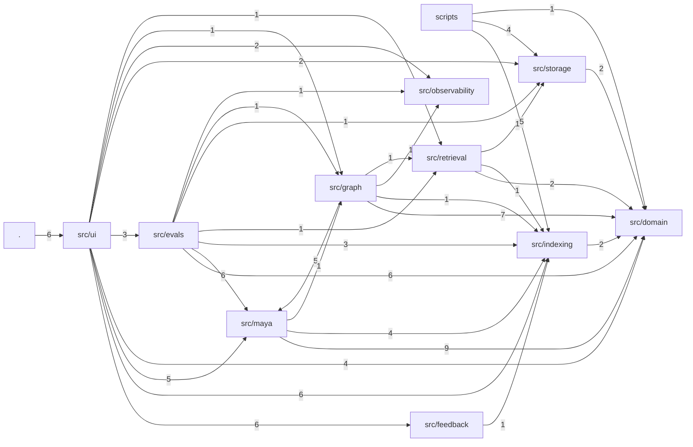

# Package dependencies — whole repo

Import edges between top-level packages, generated from `.codemap/graph.json`; edge labels are import counts. `.` is `app.py`.

## Reading notes

- **One cycle: `src/graph` ↔ `src/maya`.** Five imports go graph → maya (router, agent, guardrails, probing); one goes back: `src/maya/agent.py:24` imports `SynthesisUsage` from `src/graph/state.py`. Moving that value type into `src/domain` removes the cycle.
- **`src/domain` is the sink.** Seven packages import it; it imports nothing in the repo. ADR 0006 (pure Pydantic + stdlib) holds.
- **Two composition roots.** `src/ui` imports nine of the ten packages and is the only thing `app.py` touches. `src/evals` imports seven and drives the same components headless.
- **`src/observability` imports nothing in the repo.** It is a pure adapter over Langfuse and an in-memory ring; `graph`, `ui`, and `evals` write into it.
- **`scripts` never reach `maya` or `graph`.** Ingestion and index builds touch only `indexing`, `storage`, `domain`.
- **`prototypes/` is absent.** Nothing imports it and it imports nothing from `src`; it is dead to the dependency graph.

## Confidence

- Low-confidence edges shown: 0 (import edges are resolved by path, always high).
- Omitted: third-party imports (streamlit, langgraph, langchain, chromadb, fastembed, flashrank, langfuse, pydantic) and `tests/`.
- Graph `git_head`: f07c9eb.
