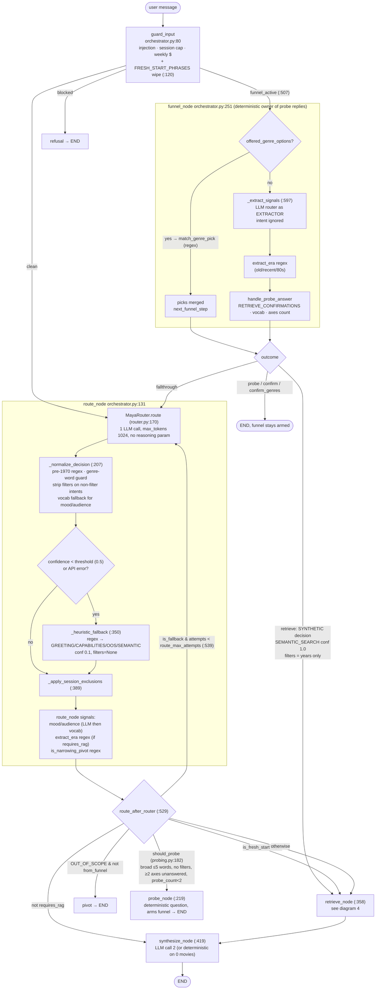
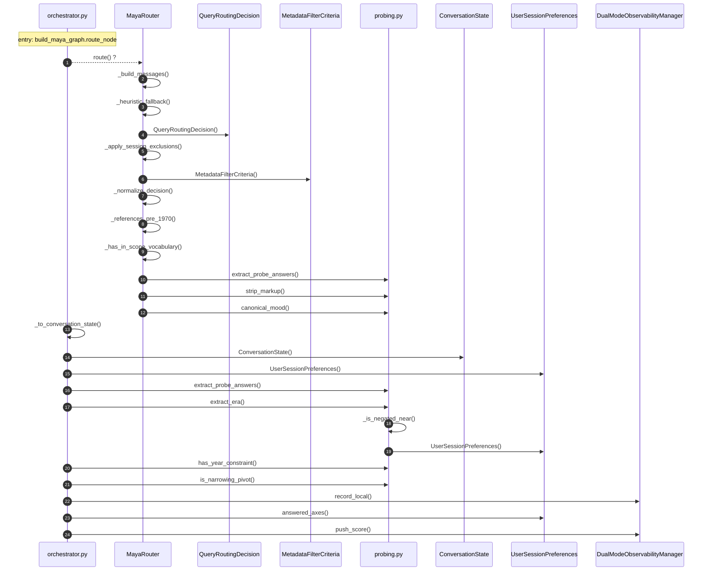
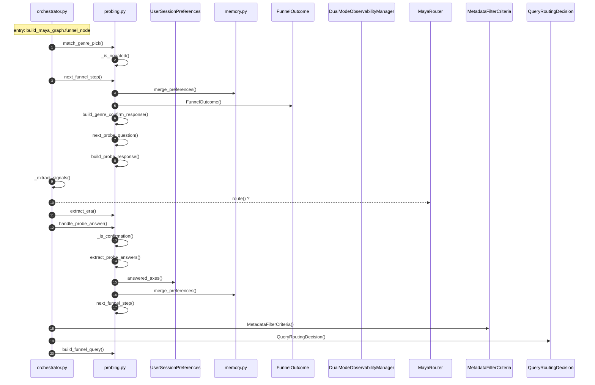

# Routing v1 architecture — how one user message becomes a retrieval

Status: the gated v1 routing path, unchanged by map #81 (Routing v2 lives beside it). Rendered page: https://claude.ai/artifact/Cfs9AzqWuc3MuN2ohnJmpr

Scope: `src/graph/orchestrator.py`, `src/maya/router.py`, `src/maya/probing.py`, `src/retrieval/hybrid_engine.py`. Graph `git_head` f07c9eb; routing code unchanged through HEAD 65c4a86 (verified with `git diff --stat`). Diagrams 2 and 3 are generated from `.codemap/graph.json` with tests filtered out. Diagrams 1 and 4 are hand-authored from the conditional-edge functions and the retrieve path, because the parser cannot see LangGraph dispatch; every box cites its line.

## 1. Control flow per turn (hand-authored, cited)

## 2. Inside route_node (generated, tests filtered)

Note: the `_chain.invoke` LLM call is external and absent. Steps 3 and 7 to 12 are alternatives in real code (fallback vs normalize). Spurious `MovieVectorStore.search` edges from `re.search` name collision were removed by hand and are noted here.

## 3. Inside funnel_node (generated, tests filtered)

## 4. Filter propagation: decision → SQLite / ChromaDB (hand-authored, cited)

```mermaid
flowchart LR
    subgraph SOURCES ["what carries a constraint"]
        DF["decision.filters<br/>MetadataFilterCriteria<br/>(LLM, only on ATTRIBUTE_FILTER / NEGATION)"]
        SP["session_preferences<br/>UserSessionPreferences<br/>(mood, audience, genres, years, exclusions)"]
    end

    DF --> EXCL["_apply_session_exclusions<br/>router.py:389<br/>merges prefs.excluded_* into filters"]
    SP -.->|"exclusions only"| EXCL
    EXCL --> RN

    subgraph RN ["retrieve_node  orchestrator.py:358"]
        Q["query = standalone_query + '(mood: …, audience: …)'<br/>TEXT ONLY"]
        G["prefs.preferred_genres → filters.genres<br/>genre_match any/all (#56)"]
        Y["prefs.year_* → NOT merged on routed turns (#78)<br/>funnel path only: synthetic decision carries years"]
    end

    RN --> ENG["HybridRetrievalEngine.retrieve<br/>hybrid_engine.py:69"]
    ENG --> PERSON["_resolve_person → db.classify_person"]
    PERSON --> PATH{"_use_sql_path :130<br/>SUPERLATIVE, or ATTRIBUTE_FILTER with<br/>exact_year / director / cast_member"}

    PATH -->|SQL| SQL["database.py:357 search_metadata_filters<br/>WHERE year, genres LIKE, director, cast,<br/>NOT LIKE excluded — full 9,119 rows"]
    PATH -->|SQL superlative| SUP["database.py:290 query_superlative"]

    PATH -->|hybrid| DENSE["_retrieve_dense :162<br/>vector_store.search(query, top_k=50)<br/>NO where_filter passed"]
    PATH -->|hybrid| BM25["_retrieve_bm25<br/>sparse_query strips excluded tokens only<br/>FTS5 MATCH, no metadata"]
    DENSE --> RRF["_rrf_fuse"]
    BM25 --> RRF
    RRF --> POST["_is_allowed :274 / matches_filters :292<br/>years · genres · person · exclusions<br/>POST-FILTER on ≤50 candidates"]
    POST --> TOPK["top_k (5)"]
    SQL --> TOPK
    SUP --> TOPK
```

## Reading notes

- **Two LLM calls per routed turn, up to three with a re-route.** Router at `route_node`, synthesizer at `synthesize_node`. The funnel calls the same router a second time as an extractor and discards its intent. Both use `~google/gemini-flash-latest`. The router is built without `reasoning_effort`, so the alias's thinking spends the 1024-token cap before JSON is emitted (#79).
- **Filters never reach ChromaDB.** `_retrieve_dense` calls `vector_store.search` without `where_filter` although the store supports it (`vector_store.py:286`). On the hybrid path, year and genre constraints are post-filters over a 50-candidate pool, so "recent feel-good date-night" can shrink to under five hits while the corpus has hundreds. Only SQL-path intents filter the full table.
- **Constraint state lives in two places with different lifetimes.** `decision.filters` is per-turn and LLM-owned. `session_preferences` is cross-turn and mostly regex-owned (mood, audience, era, pivot, fresh-start, confirmations). The merge points are `retrieve_node` (genres only), `funnel_node` (years only), and the router (exclusions only). Each missing merge is one open bug: #78 years, #80 shown ids, #56 F1/F3.
- **Deterministic gates on the routing path, counted:** pre-1970 regex, genre-word guard, confidence threshold + regex heuristic fallback, FRESH_START_PHRASES, NARROWING_PIVOT_PHRASES, RETRIEVE_CONFIRMATIONS, AFFIRMATIONS, `_MOOD_VOCAB`, `_AUDIENCE_VOCAB`, three era regexes, negation regexes, `match_genre_pick`, `should_probe` word-count rule, `MOOD_GENRE_MAP`. Fifteen vocabularies or regexes decide state that the LLM also sees. Each one was added to fix a misroute by a 3B model (#23, #26, #27, #42, #53, #56); the router has since been upgraded to Flash (#29) but the gates remain and now override the stronger model.
- **The eval dataset is single-turn.** `data/eval_benchmark_dataset.json` has 35 rows, each one query with an expected intent and relevant ids. No row exercises funnel state, exclusions, or coreference across turns. The multi-turn defects (#56, #78, #80) are only covered by live walkthrough tests.

## Confidence

- Low-confidence edges: `router.route` callers (duck-typed, 3 shown) and `_chain.invoke`. `re.search` collisions with `MovieVectorStore.search` removed from diagrams 2 and 3 by hand.
- Omitted: LangGraph runtime, Langfuse calls, the synthesizer prompt, ChromaDB and SQLite internals.
- Graph `git_head`: f07c9eb; routing sources identical at 65c4a86.
