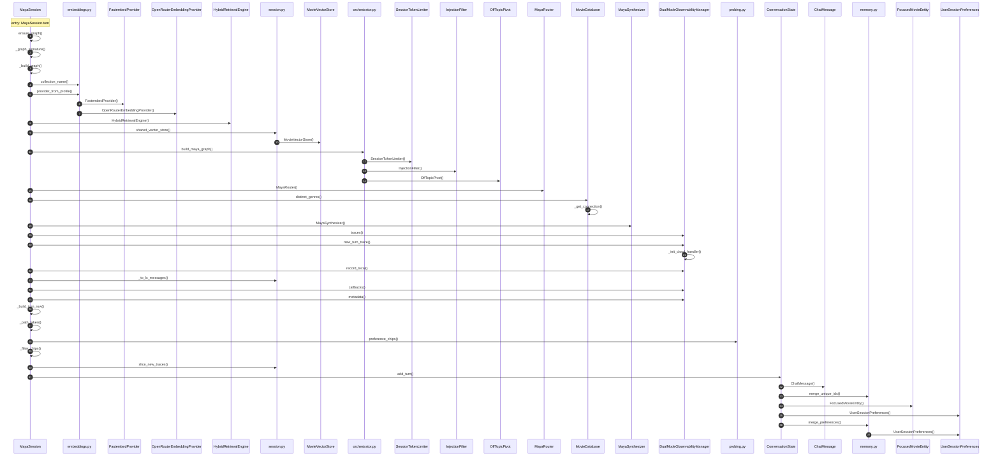

# Sequence — one chat turn, entry `MayaSession.turn`

Depth-first call order from `src/ui/session.py::MayaSession.turn` to depth 4, generated from `.codemap/graph.json`. The LangGraph run itself (`graph.invoke`) is an external call and sits between steps 24 and 25; see [sequence-retrieve-node.md](sequence-retrieve-node.md) for the inside of the retrieve node.

## Reading notes

- **Steps 1–18 are the lazy graph build.** `ensure_graph` rebuilds only when `_graph_signature` (the Experiment Config) changes. A steady-state turn starts at step 19.
- **The whole LangGraph run is invisible here.** `graph.invoke` runs guard → route or funnel → retrieve → synthesize between `metadata()` (step 24) and `_build_turn_row` (step 25). The parser cannot follow `add_node` registration, so no node appears in this sequence.
- **Step 21 (`record_local`) is conditional.** It fires only for a recalled query (`recalled=True`); the diagram cannot show the branch.
- **Steps 6 and 7 are alternatives.** `provider_from_profile` constructs one embedding provider per config, not both.
- **The turn ends in the reducer.** `ConversationState.add_turn` → `merge_preferences` (steps 30–36) decides which preferences survive to the next turn. This is where mood changes drop accumulated genres.

## Confidence

- Low-confidence edges shown: 0.
- Omitted: `graph.invoke` and every node inside it; Langfuse calls behind `new_turn_trace`, `callbacks`, `metadata`; Streamlit rendering, which happens in `render_chat` after this method returns.
- Graph `git_head`: f07c9eb.
