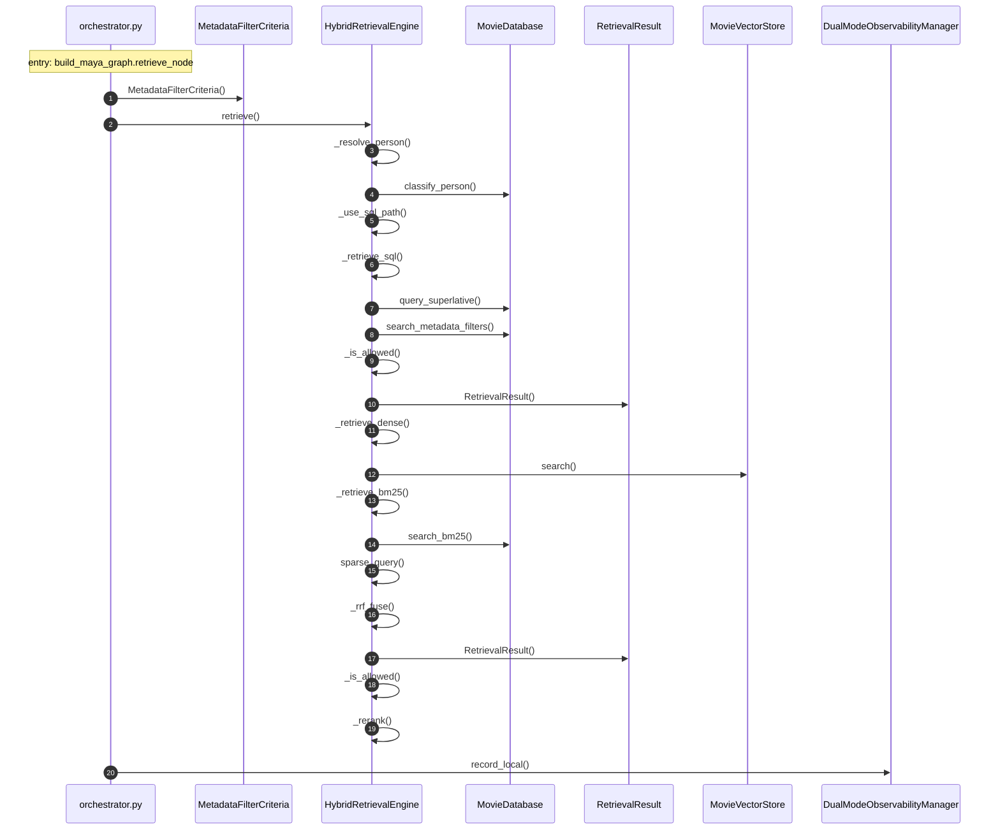

# Sequence — the retrieve node, entry `build_maya_graph.retrieve_node`

Depth-first call order from `src/graph/orchestrator.py::build_maya_graph.retrieve_node` to depth 3, generated from `.codemap/graph.json`. This is the LangGraph node the turn sequence cannot see; it is where the system reads SQLite and ChromaDB.

## Reading notes

- **Steps 6–10 and 11–19 are alternatives, not a sequence.** `_use_sql_path` (step 5) picks the SQL path for superlatives and exact filters (year, director, cast member); otherwise dense + BM25 → RRF. The diagram draws both branches back to back.
- **Inside the SQL path, steps 7 and 8 are also alternatives.** `query_superlative` serves `SUPERLATIVE_RANKING`; `search_metadata_filters` serves `ATTRIBUTE_FILTER`.
- **Step 3–4 run only when the routing decision names a person.** `classify_person` decides director versus cast so the wrong role never filters.
- **Step 19 (`_rerank`) runs only when `reranker_enabled` is on** (default off). It loads flashrank lazily; that call is external and not shown.
- **Two I/O boundaries.** `MovieVectorStore.search` (step 12) ends at a ChromaDB `query`; `search_bm25` (step 14) ends at an FTS5 query. A dense failure is recorded on the engine rather than raised; `tests/adversarial/test_retrieval_robustness.py` covers that path.

## Confidence

- Low-confidence edges shown: 0.
- Omitted: `_is_allowed` exclusion filtering per result (drawn once per branch, runs per movie); `_rrf_fuse` arithmetic; ChromaDB, SQLite, and flashrank calls beyond the boundary; the `MovieRecord` hydration inside `MovieVectorStore.search`.
- Graph `git_head`: f07c9eb.
