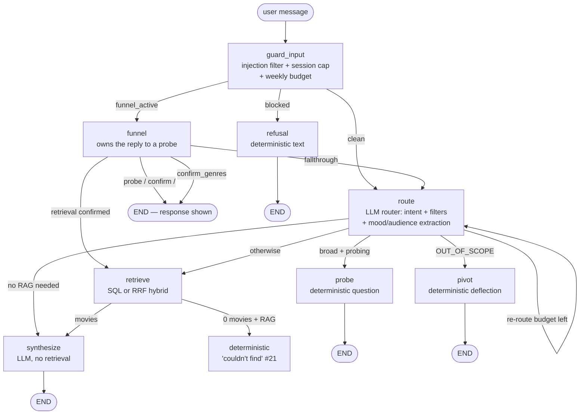
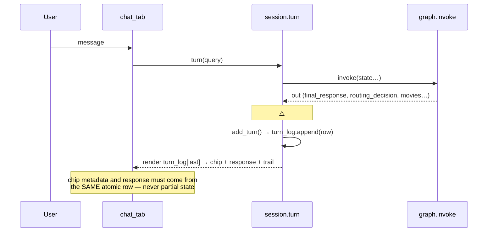

# Maya Orchestrator Flow Report

How the Maya graph behaves under different conditions — the reference for
issue #26's fixes. Every scenario below is reproducible; the incoherence
points from the #26 walkthrough are marked ⚠️ where they arise.

Related: ADR 0005 (model proposes, code disposes), issues #5 (graph),
#21 (zero-retrieval), #22/#23 (funnel), #24/#25 (extraction + genres).

## 1. Topology

## 2. State anatomy — where coherence lives or breaks

Every turn is a **fresh graph invocation**. Only the fields MayaSession
passes in survive across turns; everything else resets. This table is the
contract that keeps chips, responses and counts coherent.

| Field | Persisted across turns? | Set by | Consumed by |
|---|---|---|---|
| `messages` | ✅ (full history) | session | router (coreference), synthesizer |
| `session_preferences` | ✅ | route (signals), funnel (answers) | retrieve (flavor + genre filters) |
| `probe_count` | ✅ | probe/funnel | should_probe cap |
| `funnel_active` | ✅ | probe, funnel | guard (funnel routing) |
| `offered_genre_options` | ✅ | funnel (confirm_genres) | funnel (pick matching) |
| `current_query` | ❌ transient | guard (sanitized) | route/funnel/retrieve |
| `routing_decision` | ❌ transient | route, funnel (synthetic) | retrieve/synthesize, **UI chip** |
| `final_response` | ❌ transient | every terminal node | **UI response** |
| `retrieved_movies` | ❌ transient | retrieve | synthesize, **UI posters** |
| `session_tokens` | ✅ (accumulator) | synthesize | limiter, UI meter |
| `from_funnel` | ❌ transient | funnel (fallthrough) | route_after_router (pivot suppression) |

⚠️ **#26-A**: the UI derives the chip from `routing_decision` and the
response from `final_response`. On funnel turns that END without routing,
`routing_decision` is `None` — and `session.turn` crashes reading
`decision.intent` (session.py:142) *after* `conversation.add_turn` already
appended. Partial state → stale render → the walkthrough's impossible
combinations (OUT_OF_SCOPE chip + movie cards, 5 movies + pivot text).

## 3. Turn walkthroughs by condition

### 3.1 Fresh broad query — "suggest me something"
`guard → route → probe → END`. Router returns a broad search (≤5 words,
no filters); `should_probe` fires; probe mints the mood question and
**arms the funnel** (`funnel_active=True`).

### 3.2 Probe answer with vocab hit — "edge of the seat"
`guard → funnel → confirm_genres → END`. The funnel owns the reply; the
router runs **as extractor only** (intent ignored — #24). Mood maps to 4
candidates → genre confirmation turn, `offered_genre_options` armed.

### 3.3 Genre pick — "sci-fi and thriller"
`guard → funnel → probe → END`. Deterministic pick matching (negation-
aware); picks merge into `preferred_genres`; progression continues to the
next axis (audience).

### 3.4 Confirmation — "go ahead"
`guard → funnel → retrieve → synthesize → END`. Confirmation phrase fires
*before* the extractor; a **synthetic routing decision** is built from the
funnel query (mood + genres + audience, natural language) — the router is
never consulted. `funnel_active=False` from here.

### 3.5 Funnel fallthrough — "what about the physics of it"
`guard → funnel → route → synthesize → END`. No answers extracted →
`from_funnel=True` → an OUT_OF_SCOPE classification is **suppressed for
this turn** (it's likely an answer to Maya's own question) and the funnel
**stays armed** (#23: the user may still say "go ahead" later).

### 3.6 Specific query — "best 1970s sci-fi"
`guard → route → retrieve → synthesize → END`. Long query + superlative:
`should_probe` never fires; SQL superlative path; CWA-verified synthesis.

### 3.7 Zero retrieval — the "PG-14" case
`guard → route → retrieve → [0 movies] → deterministic #21 text → END`.
The LLM is never called with an empty closed world; refinement question
included; zero tokens.

### 3.8 ⚠️ Post-funnel refinement — "scary movies for kids" (after retrieval)
Intent: `guard → route → ???`. After the funnel's retrieval
`funnel_active=False`, so refinement turns hit the **raw router** — and the
walkthrough shows the router misclassifying them OUT_OF_SCOPE (confidence
1.00!) → pivot on an in-scope request. **#26-B + #26-C**: genre-word guard
in normalization + refinement turns must never pivot when preferences are
populated.

### 3.9 ⚠️ Router misclassification — "suggest me horror movies"
`OUT_OF_SCOPE` at confidence 1.00 for a genre request. The 3B model cannot
be trusted on genre vocabulary; **#26-B** adds the deterministic guard: a
known genre word in the query forbids OUT_OF_SCOPE.

### 3.10 Guard blocks — injection / budget
`guard → refusal → END` before any LLM sees the message (injection
patterns, session token cap, weekly $ cap).

## 4. UI turn pipeline (session → chat_tab)

## 5. Incoherence points → fixes (issue #26)

| Symptom | Root cause | Fix |
|---|---|---|
| OUT_OF_SCOPE chip + movie cards | funnel turn crashed session.turn → stale turn_log row rendered | #26-A atomic turn rows, funnel-aware metadata |
| 5 movies + 2211 tokens + pivot text | response/chip from different turns (same crash family) | #26-A |
| "suggest me horror movies" → OUT_OF_SCOPE | 3B router genre blindness | #26-B genre-word guard in normalization |
| "scary movies for kids" → pivot after retrieval | funnel disengaged + misclassification | #26-B + #26-C refinement protection |
| No "horror" mood extraction | vocab gap | #26-D genre synonyms in vocab |
| Silent filter carry-over after funnel | no announcement | #26-E transparency + reset vocabulary |
| Narrowing chips detached from badge | UI placement | #26-F inline metadata line with active filters |

## 6. Coverage map (tests pinning each path)

| Path | Unit | Adversarial | Live |
|---|---|---|---|
| 3.1 probe | test_orchestrator | probing_robustness (bounded) | probing_live |
| 3.2–3.4 funnel stages | test_probing, test_mood_genres | probing_robustness, extraction_robustness | funnel_live, extraction_live |
| 3.5 fallthrough | — | probing_robustness (pivot suppressed) | funnel_live |
| 3.6 superlative | test_orchestrator | — | prompt_live |
| 3.7 zero retrieval | test_orchestrator | orchestrator_guardrails | — |
| 3.8 post-funnel refinement | ❌ #26 | ❌ #26 | ❌ #26 |
| 3.9 genre guard | ❌ #26 | ❌ #26 | ❌ #26 |
| 3.10 guard | test_budget_tracker | injection_guardrails | — |
| UI atomicity | ❌ #26 | ❌ #26 | ❌ #26 |
